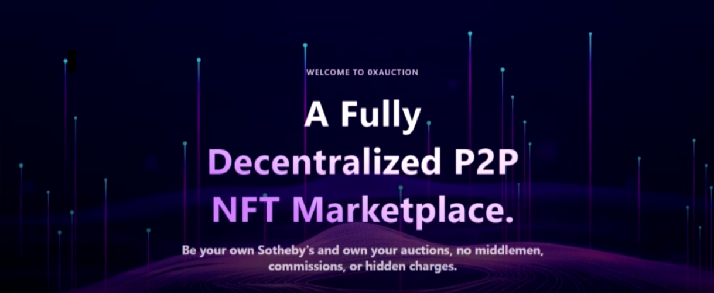
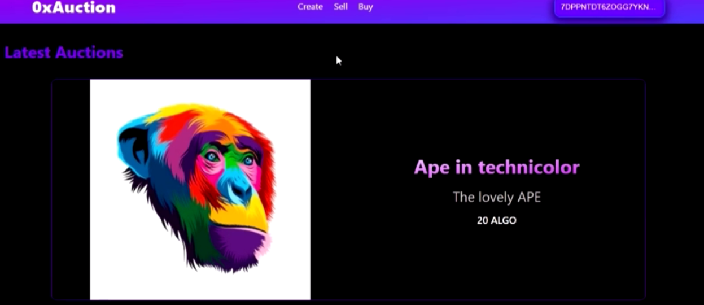
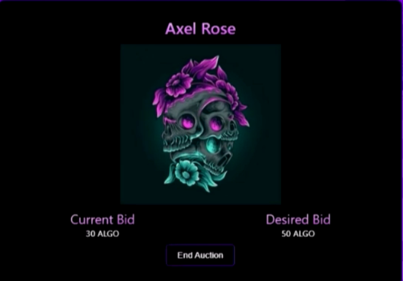

# 0xAuction 
This project was created for the Greenhouse hack 2, organized by Algorand and hosted on Gitcoin.

The DApp allows users to create NFTs, Auction NFTs and buy NFTs and other collectibles by submitting bids for them. 

Users can start an auction for the NFTs they own and other users can bid on them. Users can also optionally opt in to see the current highest bid for each auction, for every user that opts in to view the live bid of an auction, the auctioneer gets 10% of the opt in fee as a token of appreciation for using our platform. The Nft and current highest bid are always held in escrow by the contract and lesser bids previously made are returned to the respective bidders and new bids less than the highest bid are rejected.

The end game is for users to be able to create, buy and sell NFTs and other collectibles.

## Getting Started
### Pre-requisites and Local Development

Developers using this DApp should already have Reach, Docker and Node installed on their local machines.

### The guidelines for installation can be found below
[Instructions for installing Reach and Docker](https://docs.reach.sh/quickstart/)
[Instructions for installing Node](https://nodejs.org/en/download/)

In addition, they should have an Algorand wallet (preferably Pera Algo Wallet) installed on their phone and loaded with Testnet Algos in order to be able to sign transactions and share their NFts and bid on auctions. The wallet can be installed from the App store (i-Phone) or Google Play (Android) as is appropiate.

[You can some testnet Algos from the Algo Faucet](https://bank.testnet.algorand.network/).

## Running the DApp
We recommend running the DApp using Ubuntu20.04 terminal.

### Steps
- Fork the Repository.

- Clone the Repository.

- Change Directory (cd) into the directory.

Run the following commands to start up the app:

```sh
npm install

./reach compile auction.rsh

./reach compile index.rsh

./reach react

```

### Usage
- Please be aware that you would have to sign multiple transactions on your mobile device while going through most of the steps below.

- Open at least 3 browser windowsn (Advisably one incognito google chrome, one Guest google chrome and one brave browser).

- Navigate to the app at the URL http://localhost:3000.

- Click on the Connect Wallet button to activate wallet connect and scan the QR code.

- Click on the Deploy button to deploy the contract in the first browser window (be sure to copy the contract information to the clipboard after deployment) and go ahead to create an NFT and Start an Auction.

- Head on over to the next browser and connect with a separate wallet, click on the buy button, select the role of an attacher, paste the contarct information and attach. Click on the buy button and you can then go ahead to test the bidding functionality. 

- Repeat the step above with a third wallet and simulate bidding against the other user/wallet.

#### Important points to note

- Signing of transactions is mandatory for a free flow of the DApp's features.
- A user cannot have more than one instance of the DApp connected to the same 0xAuction contract while they have an auction on.
- A user can have multiple instances of 0xAuction, for the purpose of bidding on multiple auctions at a time, but can only have one instance while an auction of theirs is live.
- Asset opt-in is mandatory before bidding for an asset. If this fails, good, but if it stalls, or the request never comes up on the user's wallet, refresh the page, connect to the same 0xAuction contract and attempt the bid again; it's completely decentralized so no information of theirs is lost in this process.
- Only users who opt-in to Live bid get to see the outcome of the auction at its end, else they only get notified that the auction has ended.
- Failure on the Auctioneer's part to give a reply on the prompt to decide whether to accept the highest bid or not, would be regarded as approval to sell to the highest bidder.
- Users are not advised to use a URL shortener as opposed to the Demo, this was only stated for testing purposes as real NFTs must have a reliable media link to their NFT media file, as URL shortener providers could someday crash and their links rendered useless.
- 0xAuction is provided as a completely one-instance maintainable service, anyone can have their own instance and with many others connected to this one instance for the sake of having a pool of auctions in one place for others to bid upon, raising the likelihood of getting a bid. But at the same time, 0xAuction can be used for the sole purpose of auctioning a single asset, as long as the contract information where the asset was published is shared with others to connect to, to have access to the published auction.


We encourage you to play around with the DApp and create NFTs, Auction NFTs or bid on items at auctions.

### Troubleshooting
- Module not found: can't reslove 'react-icons/im'

If you get the above error message,

Please run the following commands:

```sh npm install react-icons ```

```sh ./reach react ```

- docker: Cannot connect to the Docker daemon at unix:///var/run/docker.sock. Is the docker daemon running?

If you get the above error message:

Please run the following commands:

```sh
sudo service docker stop

sudo service docker start

./reach react
```
- Should you encounter any other errors, please tag either goonerlabs#1008 0r Emmanuel Agbavwe#2954 on Discord.

The DApp 








### Authors

- Owolabi Adeyemi

- Emmanuel Agbavwe

### Acknowledgements

- JP Miller

- Nick Stanford

- And the Algorand Foundation and Gitcoin.
