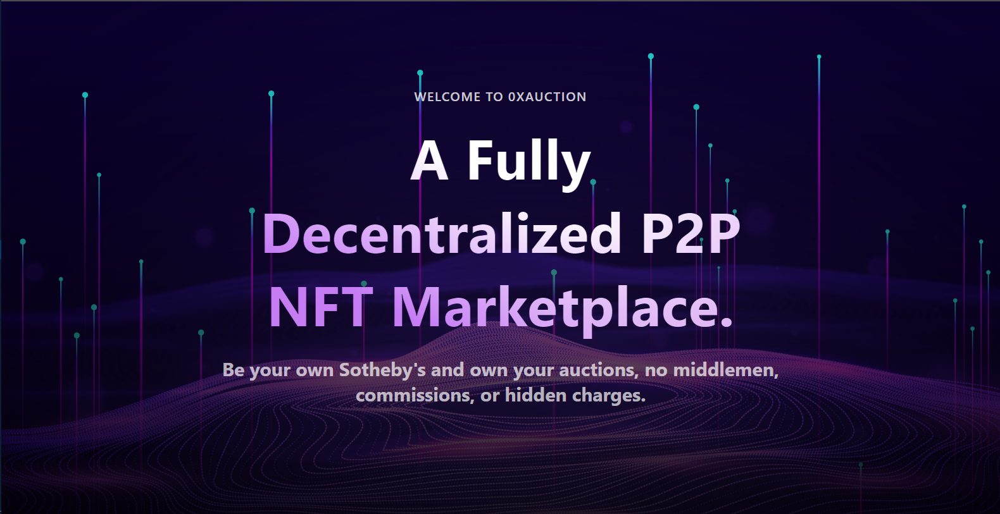
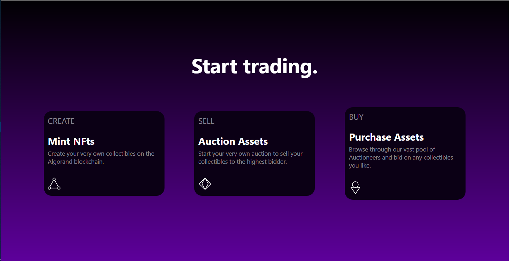
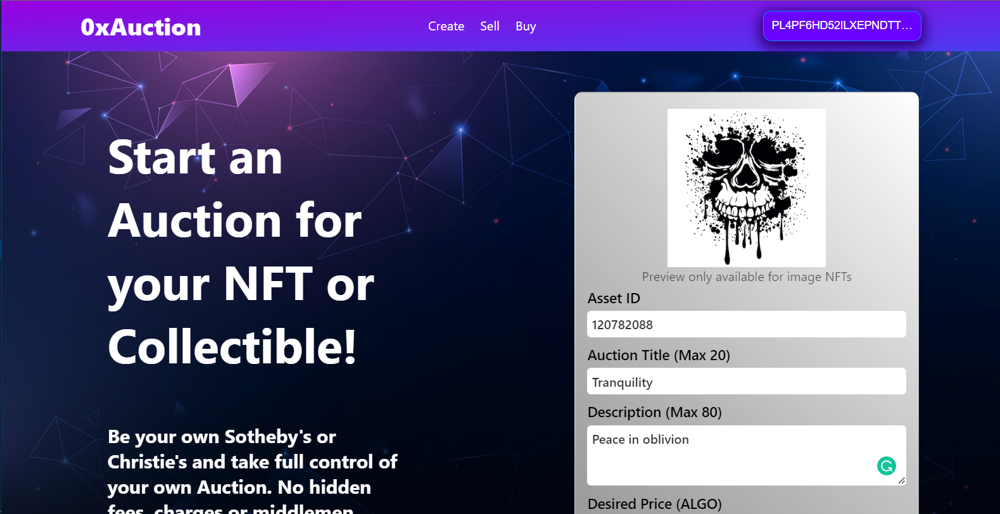
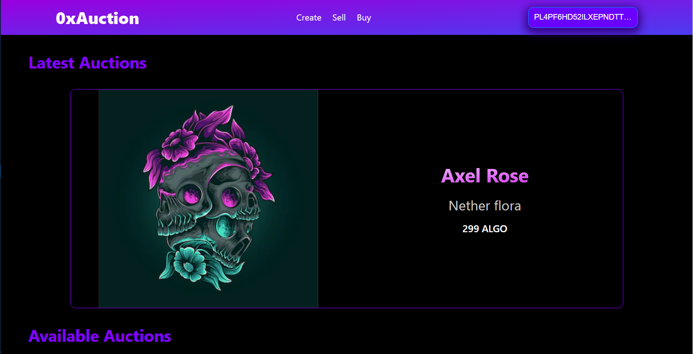
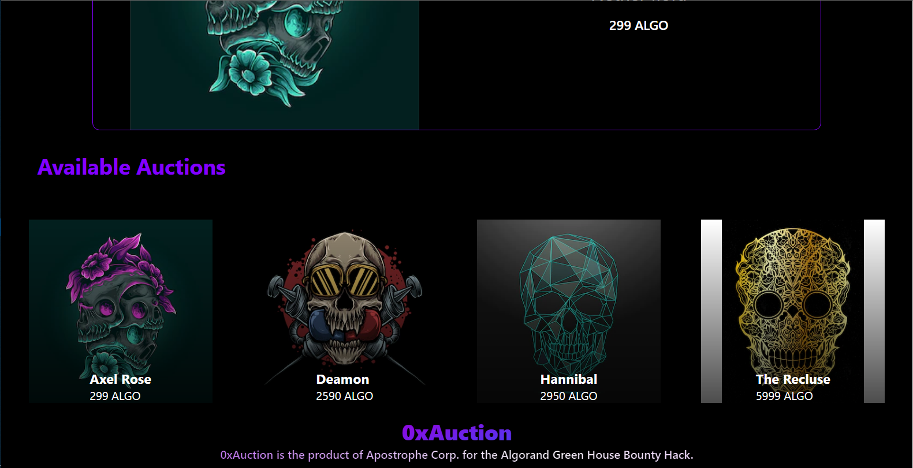
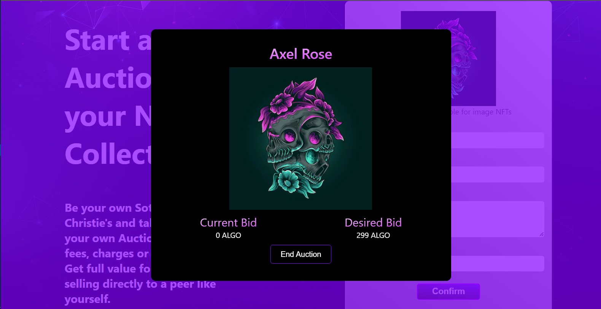
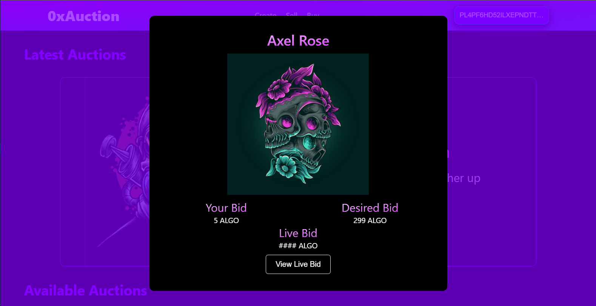
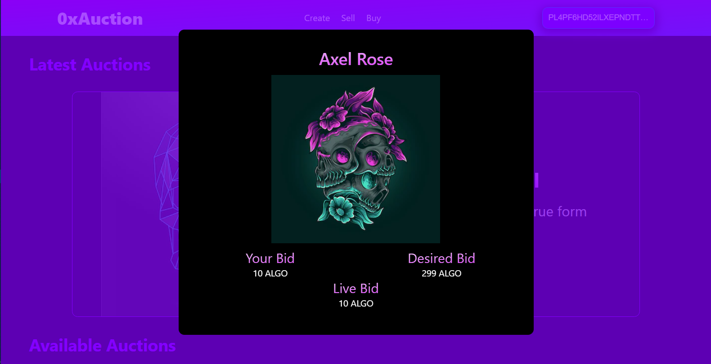

# 0xAuction

This project was created for the Polygon Hackathon.

The dApp allows users to create tokens, auction NFTs, and buy NFTs and other collectibles by submitting bids for them.

Users can start an auction for the NFTs they own and other users can bid on them. Users can also optionally opt in to see the current highest bid for each auction, for every user that opts in to view the live bid of an auction, the auctioneer gets 10% of the opt-in fee, and the rest is sent to the deployer of the 0xAuction contract as a token of appreciation for using our platform. The NFT and current highest bid are always held in escrow by the contract and lesser bids previously made are returned to the respective bidders and new bids not higher than the highest bid are rejected.  

The end game is for users to be able to create tokens, buy and sell NFTs and other collectibles without a central dependency.

## Getting Started

- Fork the repository and or clone the repository.

- Change directory (cd) into the directory.

Then run the following commands to start up the dApp:

```sh
>> npm install

>> npm start

```

For a build optimized version, run:

```sh
>> npm run build
```

### Environment Variables

Paste the following in a `.env` file in the root directory of your project.

```text
REACT_APP_ALCHEMY_TOK_API_URI='https://polygon-mumbai.g.alchemy.com/v2'
REACT_APP_ALCHEMY_NFT_API_URI='https://polygon-mumbai.g.alchemy.com/nft/v2'
REACT_APP_ALCHEMY_API_KEY='70Pzn-vt9wS8yo6mrFsVGsZ5PX2-i2Ss'
REACT_APP_REACH_CONNECTOR_MODE='ETH'
```

### Usage

- When using our dApp, interactions that would require a communication to be made with the blockchain through your account would require you sign some transactions. The following interactions are to be taken note of:  
  - Deployment of an 0xAuction contract - usually 3 transactions.
  - Minting of a token - just 1.
  - Starting an auction - multiple transactions.
  - Placing a bid - just 1.
  - Opting in for Live Bid - just 1.
  - Ending an auction - multiple transactions.

- To experience all the features of our dApp, we advise you open at least 3 browser windows (For instance one Incognito Google Chrome tab, one Guest Google Chrome tab and one Brave browser tab).

- Navigate to the app at the URL `http://localhost:3000`.

- Click on the **Connect Account** button and proceed to connect your MetaMask Wallet.

- Click on any of the features of the dApp, Create, Sell, or Buy to start the process to launch or connect to, an 0xAuction contract.

- Upon selecting 'Deploying' as your desired action, and signing all transactions on your wallet, your 0xAuction contract would be deployed (be sure to copy the contract information to the clipboard after deployment), and you can head over to the second browser tab to create a token or Start an Auction.

- Head on over to the next browser and connect with a separate wallet, click on the **Buy** button, select 'Attaching' as the desired action, paste the 0xAuction contract information and attach. Click on the **Buy** button and you can then go ahead to test the bidding functionality.

- Repeat the step above with a third wallet and simulate bidding against the other users/wallets.

#### Important points to note

- Signing of transactions is mandatory for a free flow of the dApp's features.
- A user cannot have more than one instance of the dApp connected to the same 0xAuction contract while they have an auction on, for all views will have the auction on display.
- A user can have multiple instances of 0xAuction, for the purpose of bidding on multiple auctions at a time, but can only have one instance while an auction of theirs is live.
- Asset opt-in is mandatory before bidding for an asset. If this fails, good, but if it stalls, or the request never comes up on the user's wallet, refresh the page, connect to the same 0xAuction contract and attempt the bid again; it's completely decentralized so no information of theirs is lost in this process.
- Only users who opt-in to Live bid get to see the outcome of the auction at its end, else they only get notified that the auction has ended.
- Failure on the Auctioneer's part to give a reply on the prompt to decide whether to accept the highest bid or not, would be regarded as an approval to sell to the highest bidder.
- 0xAuction is provided as a completely one-instance maintainable service, anyone can have their own instance and with many others connected to this one instance for the sake of having a pool of auctions in one place for others to bid upon, raising the likelihood of getting a bid. But at the same time, 0xAuction can be used for the sole purpose of auctioning a single asset, as long as the contract information where the asset was published is shared with others to connect to, to have access to the published auction.

We encourage you to play around with the dApp and create NFTs, auction NFTs or bid on items at 0xAuction's pool of auctions.

### Troubleshooting

- Should you encounter any errors, please tag either `goonerlabs#1008` 0r `Emmanuel Agbavwe#2954` on [Reach's Discord server](https://bit.ly/3BnPyKd).

## The DApp

  








## Authors

- [Owolabi Adeyemi](https://github.com/goonerlabs)

- [Emmanuel Agbavwe](https://github.com/Aro1914)

## License

The 0xAuction project is licensed under the [Apache License, Version 2.0](./LICENSE).
